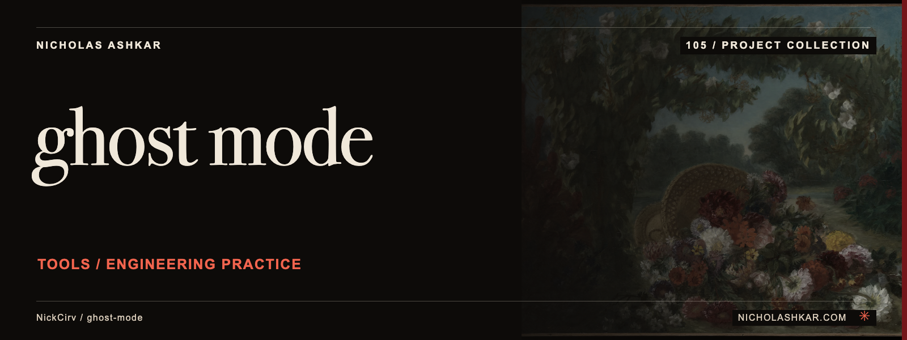

# ghost-mode

Install local Claude Code hook scripts for selected editing and shell-command checks.


<a id="usage"></a>

## What it does

Adds project .claude/settings.json hooks and supports install, uninstall, status and aggressive/balanced/subtle configurations. The bundled scripts check patterns such as console logging and secret-like text. See the pinned [implementation](https://github.com/NickCirv/ghost-mode/blob/a3f33122bdfa8ad617753b9f8b7a0348fdfe690c/bin/ghost.js).


<a id="install"></a>

## Quickstart

Node requirement from the inspected manifest: **`>=20`**. Installation and config commands rewrite project settings. Review the bundled shell scripts and existing hooks before enabling them.

The following example is **source-inspected, not executed**. It uses a pinned checkout; npm package publication is not assumed. Replace project paths or provide the stated input fixtures before running it.

```bash
git clone https://github.com/NickCirv/ghost-mode.git
cd ghost-mode
git checkout a3f33122bdfa8ad617753b9f8b7a0348fdfe690c
npm install --ignore-scripts
node bin/ghost.js status
```

Dependencies are installed with lifecycle scripts disabled in this recipe. Read the package scripts before enabling any lifecycle step required by your environment.

## Usage and reference

`ghost-mode` are the executable names declared by the package. [Command reference](docs/REFERENCE.md) covers source-backed options and entry points.

| Control | Behavior in the inspected implementation |
| --- | --- |
| `status` | Inspect installation through the existing status detector |
| `install --mode MODE` | Write hooks using aggressive, balanced or subtle mode |
| `config MODE` | Update mode and reinstall hooks |
| `uninstall` | Remove marked Ghost hooks |

## Limits and operational notes

These are scripted checks, not an autonomous AI reviewer. The captured status implementation looks for matcher ghost-mode while generated hook matchers use tool names, so status can under-report an installation. Inspect settings directly when troubleshooting.

## Development

No runtime checks were executed for this documentation review. The committed smoke test checks entrypoint JavaScript syntax; it does not exercise the command behavior.

| Script | Declared command |
| --- | --- |
| `start` | `node bin/ghost.js` |
| `test` | `node --test` |

Work from the pinned source, keep changes focused, and reproduce the affected behavior with a small fixture before proposing a change. Existing contribution and security policies remain authoritative where present.

## Research and status

[Research record](docs/RESEARCH.md) identifies the inspected revision, source evidence, documentation disposition and verification gaps. Static inspection supports the descriptions here; runtime behavior, dependency installation and current hosted services remain unverified.

## License and author

[License](https://github.com/NickCirv/ghost-mode/blob/a3f33122bdfa8ad617753b9f8b7a0348fdfe690c/LICENSE)

[Nicholas Ashkar](https://nicholashkar.com) · Applied AI, systems and consulting.
