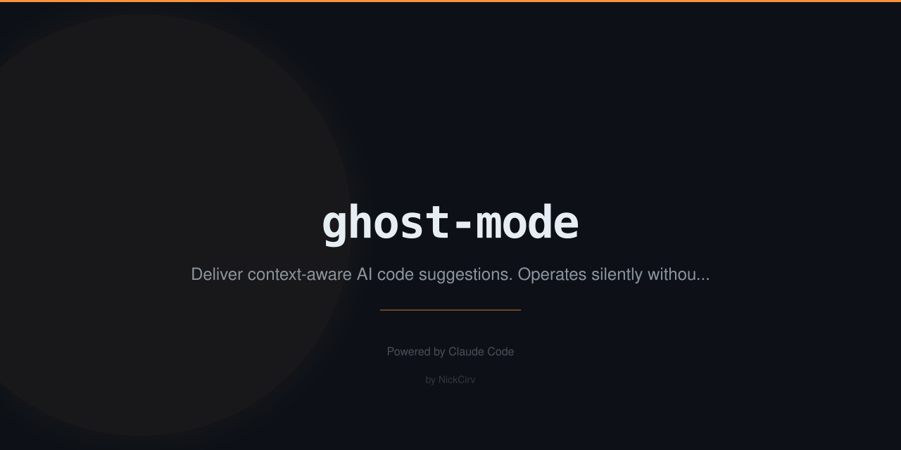

# ghost-mode

> Invisible AI pair programmer. Whispers when you need it.

[](https://www.npmjs.com/package/ghost-mode)
[](LICENSE)
[](https://github.com/NickCirv/ghost-mode/stargazers)

## The Problem

Linters catch syntax. Code review catches logic. Nobody catches the "you just committed an API key" or "that console.log is going to production" moments in real-time. Ghost Mode does — silently, without blocking your flow, without asking permission. It just whispers.

## Quick Start

```bash
npx ghost-mode install
```

That's it. Keep coding. You won't notice Ghost Mode is there — until it has something to say.

```bash
# Check current sensitivity level
npx ghost-mode status

# Change sensitivity
npx ghost-mode config balanced

# Remove Ghost Mode
npx ghost-mode uninstall
```

## Example Output

Ghost is silent when everything is fine. When it notices something, it whispers inline — no popups, no blocks:

```
  Psst... console.log on line 47. Remove before commit.
  'useAuthToken' on line 3 looks unused. Safe to remove?
  Type error: 'string' is not assignable to type 'number' on line 82.
  That looks like a hardcoded secret on line 15. Use an env var instead?
  That command looks dangerous (rm -rf). Double-check the target?
```

## Features

- **Zero interruption** — whispers suggestions, never blocks your flow
- **5 ghost watchers** — each monitors a different class of issue
- **3 sensitivity levels** — aggressive, balanced, subtle
- **Hook-based** — installs as Claude Code hooks, runs natively in your workflow
- **Uninstalls cleanly** — one command, no traces

## Ghost Sensitivity

```bash
# Aggressive: whispers about everything
npx ghost-mode config aggressive

# Balanced (default): security + errors only
npx ghost-mode config balanced

# Subtle: only critical security issues
npx ghost-mode config subtle
```

## What Ghost Watches

| Ghost | Watches For | Fires When |
|-------|------------|------|
| Console Ghost | `console.log` in JS/TS files | After file edits |
| Type Ghost | TypeScript errors | After `.ts`/`.tsx` edits |
| Import Ghost | Unused imports | After file edits |
| Secret Ghost | Hardcoded credentials and API keys | After file edits |
| Danger Ghost | Risky shell commands (`rm -rf`, `DROP TABLE`) | Before bash execution |

## Ghost Rules

1. Ghosts **never block** — they only suggest
2. Ghosts **never modify** your code — you decide what to do
3. Ghosts are **silent** when everything is fine
4. Ghosts **disappear** completely when you uninstall

## How It Works

1. `npx ghost-mode install` writes hook configs into your Claude Code settings
2. Hooks fire on `PostToolUse` (file edits) and `PreToolUse` (bash commands)
3. Each ghost runs a targeted check — no AI calls for simple pattern matches
4. When a ghost has something to say, it appends a whisper to your Claude session
5. You act on it or ignore it — Ghost never follows up

## Requirements

- Claude Code (hooks feature required)
- Node.js 18+

No API key needed. Ghost Mode uses Claude Code's native hook system — no extra AI calls unless you're running an AI-powered ghost in aggressive mode.

## See Also

- [fix-it-felix](https://github.com/NickCirv/fix-it-felix) — Self-healing CI pipeline
- [ai-code-roast](https://github.com/NickCirv/ai-code-roast) — Brutal AI code reviews

## License

MIT — [NickCirv](https://github.com/NickCirv)
